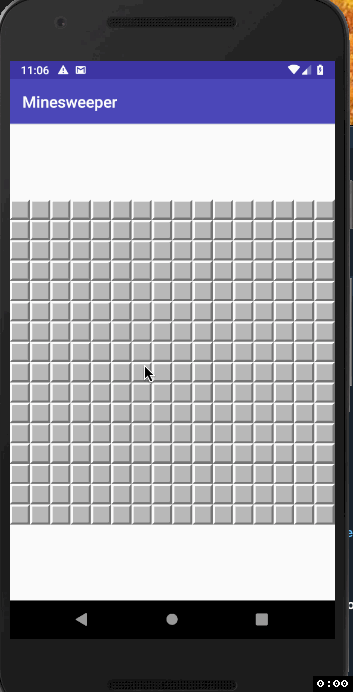

#  Minesweeper 
### The only good Minesweeper Android App

__Demo:__

### What's different about it?
The controls! as if you were playing on your computer with only right clicks:
- Every tap on a hidden block flags it
- Every tap on a number reveals all its neighbors - **if they are properly flagged**
- Holding a hidden block always reveals it

## Contributors:
- Huge thanks to [@NiteAx](https://github.com/NiteAx) for supplying the art for the mine tile and app icon!
- The rest of the assets for tiles were supplied by Kazukiokumura, under the Creative Commons Attribution-Share Alike all of them can be found on [wikimedia](https://commons.wikimedia.org/wiki/Category:Minesweeper)
- The [ZoomLayout Library](https://github.com/natario1/ZoomLayout) which this project heavily relies on